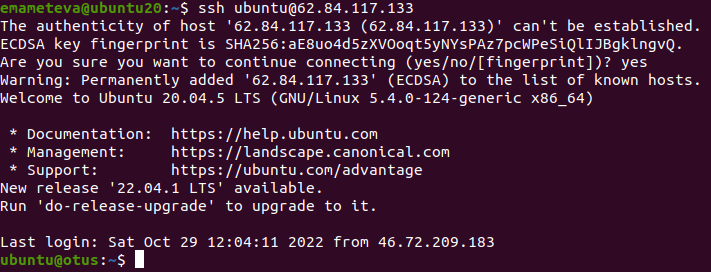

* Создан инстанс ВМ (имя - **otus**) в пространстве **Яндекс cloud**.
* Создана VM VurtualBox c Ubuntu 22.04 LTP hostname **emameteva-VirtualBox**.
* На VM emameteva-VirtualBox сгенерирован ssh, который добавлен в инстанс вм в Яндекс.
* Зашли с помощью ssh ключа с VM VurtualBox на VM otus.

* Пробуем второе подключение, сделаем его с еще одной VM VurtualBox на которой Ubuntu 20.04. Генерируем ssh и добавляем его в файл nano authorized_keys на нашей ВМ Яндекса.
* Подключение прошло успешно (hostname второй виртуалки ubuntu20)

