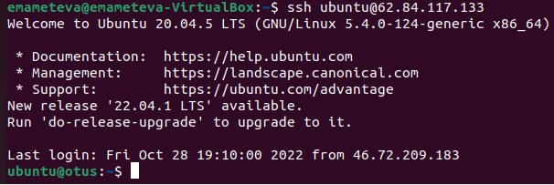

#  Работа с уровнями изоляции транзакции в PostgreSQL
* Создан инстанс ВМ (имя - **otus**) в пространстве **Яндекс cloud**.
* Создана VM VurtualBox c Ubuntu 22.04 LTP hostname **emameteva-VirtualBox**.
* На VM emameteva-VirtualBox сгенерирован ssh, который добавим в инстанс вм в Яндекс.
* Зашли с помощью ssh ключа с VM VurtualBox на VM otus.

* Пробуем второе подключение, сделаем его с еще одной VM VurtualBox на которой Ubuntu 20.04. Генерируем ssh и добавляем его в файл nano authorized_keys на нашей ВМ Яндекса.
* Подключение прошло успешно (hostname второй виртуалки ubuntu20)

* Поставим Postgres14
* Проверяем кластер

* Запускаем во всех сеансах psql

* Создаем таблицу persons с двумя строками. По умолчанию у нас уровень изоляции **read commited**
* Отключаем автокоммит
* В первом сеансе добавляем третью строку, транзакцию не завершаем.
* Проверяем что видит у нас вторая сессия:

Она видит только две строки, потому что третья еще не завершена первым сеансом. Текущий уровень изоляции не читает неподтвержденные данные.
* Завершаем транзакцию в первом сеансе и снова делаем select во втором:

Как видим теперь читается и третья строка потому что мы подтвердили внесение изминений.

* Устанавливаем уровень REPEATABLE READ.
В первой сессии вносим 4ую строку. Делаем селект во второй:

Видим так же только подтвержденные строки. Т.к. мы повысили уровень (а не понизили, да и постгрес его не понизит) аномалии не видим в этом случае.
* Подтверждаем изминения в первой сессии. Проверяем данные во второй, они не изменились.

Т.к. здесь еще более строгий уровень изоляции. Исключается грязное чтение, происходит блокировка обрабатываемых строк и не допускается изминения другими транзакциями.

* Завершаем транзакцию во второй сессии и повторяем селект:

Данные наконец обновились, т.к. у нас идет чтение и блокировка уже всех изминенных и подтвержденных строк.

